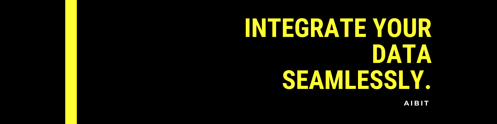
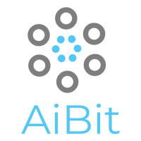

<p>
    
</p>


<!-- [](https://git.io/typing-svg) -->

### 👋 *HI, I'M URI and I'm a CPA turned dev that specializes in custom API integrations*

<p><a href="https://www.automationconslt.com">➡️ Check out my website</a></p>

<details>
 <summary><mark style="background-color: lightblue">Table of Contents</mark></summary>
<div>

#### **Table of Contents**

- [Overview](#overview)
- [Experience](#experience-in-years)
- [Past Projects](#past-projects)
- [Work History](#past-work-history)
- [Education](#education)
- [Github Stats](#github-public-stats)
- [Github Private Stats](#github-private-stats)
- [Visitor Stats](#visitor-stats)
- [References](#references)
- [Contact Info](#contact-me)

</div>
</span>
</details>

#### **Overview**
🔭 I’m currently working on ...

 1. Integrating bank transactions into an accounting system. (900+ bank accounts)
 1. Integrating time clock system and payroll software. (300+ Employee are paid based off this data)
 1. Random Object creation based off web resources. [Link to Github](https://github.com/uricod/random-text)

🌱 I’m currently learning ...
- 
- 

👯 I’m looking to collaborate on ...
1. DAO's, blockchain and open source API libraries.

#### **Experience in Years**
[](https://shields.io/)
[](https://shields.io/)
[](https://shields.io/)

#### **Past Projects**
> For these past projects I have a person at each company that can verify the below claims.

<details>
 <summary><mark style="background-color: lightblue">Metro Medical Integration</mark></summary>
<div>

 ```python
 def integrate_metro_invoices(metro_invoices, Intacct):
     """
    Integrated a vendor bills into Intacct. There were 1500 bills a month being processed manually. 
     """
     hours_saved="thousands"
     return "done"
 ```

</div>
</span>
</details>

<details>
 <summary><mark style="background-color: lightblue">Monday.com Integration</mark></summary>
<div> 

 ```python
 def integrate_metro_invoices(monday.com, Central_DB):
     """
     Integrated Monday.com Referrals into a central DB warehouse for BI.
     """
     live_referral_analytics = ✔️
     return "done"
 ```

 </div>
</details>

<details>
 <summary><mark style="background-color: lightblue">Box.com and Medical billing System</mark></summary>
<div> 

 ```python
 def integrate_billing_system(box.com, point_click_care):
     """
     Integrated Aging system from PCC to smartsheets built app through box.com
     """
     hours_saved = 100 and 'counting'
     return "done"
 ```

 </div>
</details>

<details>
 <summary><mark style="background-color: lightblue">Intacct & Payroll System</mark></summary>
<div> 

 ```python
 def integrate_payroll_accruals(Intacct, payroll_system):
     """
     Integrated accounting system and payroll system so all data is brought over accurately and automatically..
     """
     hours_saved = 1000 and 'counting'
     return "done"
 ```

 </div>
</details>

#### **Past Work History**

1. </img> Jan 2016 - Intern at PriceWaterHouseCoopers - Assurance Associate 

1. </img> Mar 2016 - Feb 2018 - Finance Manager @ LTC Consulting Services. 

1.  </img> April 2018 - Current: Founder of AiBit - Working on Integrations from A - B integrations, A - Warehouse, and A - Custom Reports.

#### **Education**
1.  </img> Masters In Accounting.
1. Self Taught Coder.

#### **Github Public Stats**


#### **Github Private Stats**


#### **Visitor Stats**


#### **References**
>For references please message me on LinkedIn.

#### **Contact Me**
> You can submit query on website above or pm on LinkedIn.

